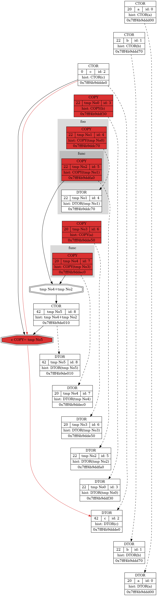
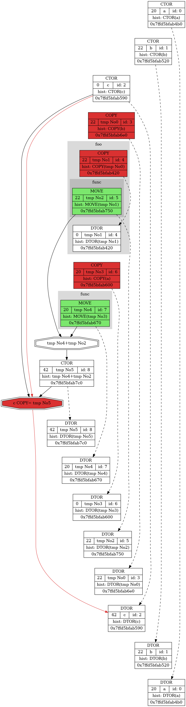

**INVESTIGATION OF COPY AND MOVE OPERATORS**
===================================================
**AUTHORS**
-----------
Research was conducted by a second year student at MIPT Anna Savchuk in 2022.

**BEGINNING**
-------------
This project contains intercepted realisation of 32-bit int type. In the README the difference between compilator behavior when using move operators and not. 

Important flag of compilator is `-fno-elide-constructors`. It disables all optimizations connected with copy operators.

OS: Linux.

**MOTIVATION**
--------------
Maybe some of readers have already heard about how bad copying is. One of the reasons is that it may be much slowlier when copying big data, for example. That is why passing by reference and using move operators are so important.

The problem is that words are not as persuasive as the author is willing them to be. That is why some illustrative examples will be presented.

**HOW TO CONDUCT YOUR OWN INVESTIGATION**
-----------------------------------------
<li>
  If you want to play with using move operators or not, go to math_structures/Intercepted_int.hpp and comment or uncomment the line where MOVE_ON macros is defined.
</li>
<li>
  In your console type <pre><code>make clean</code></pre> It just makes sense :).
</li>
<li>
  Then type <pre><code>make run</code></pre> Enjoy the picture!
</li>
<li>
  If you want to observe text dump, just open Int_dump.html.
</li>

**TEST_PROGRAM**
----------------
To test the difference the author used the code, presented in Microscope/Test1.hpp.

To "catch" variables with their names macros `VAR(variable_name, initial_value)` used. Without it variables will be considered as temporary~--- as they are made by compiler.

To "catch" functions we step in or out class Spy is used. It gets macros `__FUNCTION__` to get the name of function to dump it.

The code itself is 
pre><code>Intercepted_int func(Intercepted_int var)
{
    Spy spy(__FUNCTION__);
    
    return var;
}

Intercepted_int foo(Intercepted_int var)
{
    Spy spy(__FUNCTION__);
    
    return func(var);
}

void test0()
{
    VAR(a, 20);
    VAR(b, 22);
    VAR(c, 0);
    
    c = func(a) + foo(b);
}</code></pre>

**FIRST COMPARISON**
----------------------------
| WITHOUT | WITH |
|:----------------:|:---------:|:----------------:|
|  |  |

**TO BE CONTINUED**
-------------------
You will be able to observe some examples soon.

**LITERATURE AND LINKS**
------------------------
<li> 
[Author's github page](https://github.com/s-a-v-a-n-n-a)
</li>
<li>
  [rvalue-links (short <s>int</s>) in Russian](https://habr.com/ru/post/226229/)
</li>
<li>
  [rvalue-links (long <s>int</s>) in Russian](https://habr.com/ru/post/322132/)
</li>
