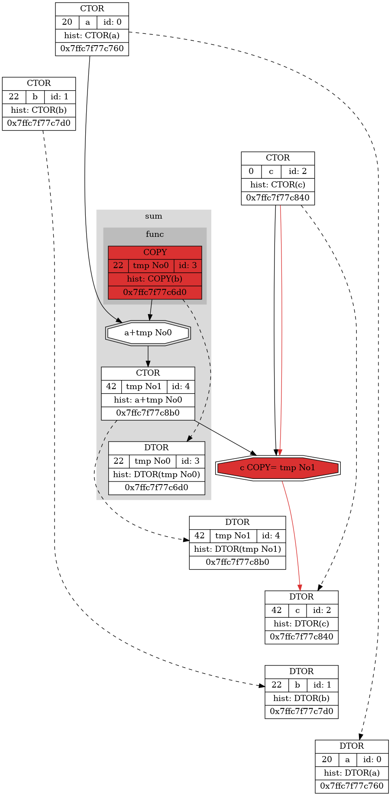
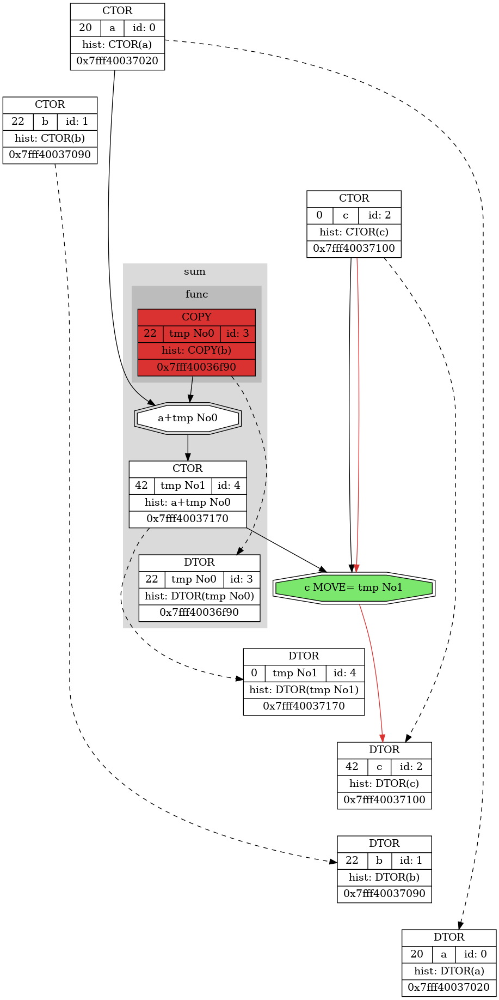

**INVESTIGATION OF COPY AND MOVE OPERATORS**
===================================================
**AUTHORS**
-----------
Research was conducted by a second year student at MIPT Anna Savchuk in 2022.

**INTRODUCTION**
----------------

Maybe some of readers have already heard about how bad copying is. One of the reasons is that it may be much more slowly when copying big data, for example. That is why passing by reference and using move operators are so important.

The problem is that words are not as persuasive as the author is willing them to be. That is why some illustrative examples will be presented.

**INSTRUMENTS**
---------------

This project contains intercepted realisation of 32-bit int type. In the README the difference between compilator behavior when using move operators and not. 

OS: Linux.

The  author used text dump in html and visual dump in dot to conduct the investigation. For reasons of beauty and clarity only dot dump will be shown. To see the text one read the next paragraph.

There are several designations in graphical dump used. 
<li>
  Red structions show copy operators. Green ones are for move operators.
</li>
<li>
  Black dashed arrows are for showing the time that variable exists. They link its constructor and destructor respectively.
</li>
<li>
  Black solid lines show the connections between operations. If two numbers are added, the reader will be able to see connections between struction for operator+ and structions for variables. 
</li>
<li>
  To show the changes of the variable red solid arrows used. As not to clutter up the picture there is no red lines between constructors and destructors if they are only operators that changed the variable.
</li>
<li>
  Grey clusters used for entering the scope of a function. Its name is also written on clusrter's top.
</li>
<li>
  <em><b>Picture 0</b></em> shows the organization of information in rectangle boxes. For reasons of clarity the history shows operations since last change of variable.
</li>
<li>
  Hexagons show binary operations.
</li>

<em><b>Picture 0</b></em>

<em>The structure of rectangles.</em>

**HOW TO CONDUCT YOUR OWN INVESTIGATION**
-----------------------------------------
<li>
  If you want to play with using move operators or not, go to math_structures/Intercepted_int.hpp and comment or uncomment the line where MOVE_ON macros is defined.
</li>
<li>
  In your console type <pre><code>make clean</code></pre> It just makes sense :).
</li>
<li>
  Then type <pre><code>make run</code></pre> Enjoy the picture!
</li>
<li>
  If you want to observe text dump, just open Int_dump.html.
</li>

**MOTIVATION**
------------------------

Important flag of compilator is `-fno-elide-constructors`. It disables all optimizations connected with copy operators.

Using code written below and turning on and off this flag the results in the table can be seen.

<pre><code>Intercepted_int secret_func()
{
    Spy spy(__FUNCTION__);

    VAR(in_secret, 128);
    return in_secret;
}

Intercepted_int func(Intercepted_int var)
{
    Spy spy(__FUNCTION__);
    
    return var;
}

void test0()
{
    VAR(a, 20);
    VAR(c, 0);
    
    c = func(a) + secret_func();
}</code></pre>

| WITHOUT COPY ELISION | WITH COPY ELISION |
|:--------------------------------------------------------------------:|:----------------------------------------------------------------------:|
|  |  |
| ***Picture 1*** 4 copies; 4 temporary variables                                                 | ***Picture 2*** 3 copies; 3 temporary variables                                                   |

It may seem that programmers can only use this flag. But using next examples he will get same results despite of turning off `-fno-elide-constructors`.

In next code this flag will be turned on.

**TEST PROGRAM**
----------------
To test the difference the author used the code, presented in Microscope/Test1.hpp.

To "catch" variables with their names macros `VAR(variable_name, initial_value)` used. Without it variables will be considered as temporary - as they are made by compiler.

To "catch" functions we step in or out class Spy is used. It gets macros `__FUNCTION__` to get the name of function to dump it.

The code itself is 
<pre><code>Intercepted_int func(Intercepted_int var)
{
    Spy spy(__FUNCTION__);
    
    return var;
}

Intercepted_int foo(Intercepted_int var)
{
    Spy spy(__FUNCTION__);
    
    return func(var);
}

void test0()
{
    VAR(a, 20);
    VAR(b, 22);
    VAR(c, 0);
    
    c = func(a) + foo(b);
}</code></pre>

**FIRST COMPARISON**
--------------------
| WITHOUT MOVES | WITH MOVES |
|:------------------------------------------------------------------:|:------------------------------------------------------------------:|
|  |  |
| ***Picture 3*** 6 copies; 6 temporary variables                                                    | ***Picture 4*** 4 copies; 6 temporary variables 2 moves!                                                   |

The difference in amount of using copying can be seen from the table above. Six copies can be decreased to four.

**CHANGING TEST PROGRAM**
-------------------------
Using move operators is not the only one way to decrease copying. Furthermore, sometimes programmers do not need them at all - for example, in small projects or in projects where all data is simple (no vectors or arrays are used). For that reason passing by reference can help.

In code below it is shown how it can be changed to test "new" opportunity with turning off all move operators.

<pre><code>
Intercepted_int func(const Intercepted_int &var)
{
    Spy spy(__FUNCTION__);
    
    return var;
}

Intercepted_int foo(const Intercepted_int &var)
{
    Spy spy(__FUNCTION__);
    
    return func(var);
}

void test0()
{
    VAR(a, 20);
    VAR(b, 22);
    VAR(c, 0);
    
    c = func(a) + foo(b);
}
</code></pre>

**SECOND COMPARISON**
---------------------

| PASSING BY VALUE | PASSING BY REFERENCE |
|:------------------------------------------------------------------:|:----------------------------------------------------------------------------------:|
|  |  |
| ***Picture 3*** 6 copies; 6 temporary variables                                                    | ***Picture 5*** 3 copies; 3 temporary variables                                                                    |

It can be seen six copies can be decreased to three.

**MOVES ARE USELESS?**
----------------------
Okay, there are move operations and constant links that can be used. And last example showed that copy links are quite effective in avoiding copying. If we now turn on move operators we cannot see any use of them in this test. The question comes: maybe moves are useless?

The answer is "No". 

The next code is to show that moves are used by compilator to det rid of copies.

<pre><code>Intercepted_int func(const Intercepted_int &var)
{
    Spy spy(__FUNCTION__);
    
    return var;
}

Intercepted_int sum(const Intercepted_int &var1, const Intercepted_int &var2)
{
    Spy spy(__FUNCTION__);

    return var1 + func(var2);
}

void test0()
{
    VAR(a, 20);
    VAR(b, 22);
    VAR(c, 0);
    
    c = sum(a, b);
}
</code></pre>

For short version:

<pre><code>Intercepted_int sum(const Intercepted_int &var1, const Intercepted_int &var2)
{
    Spy spy(__FUNCTION__);

    return var1 + var2;
}

void test0()
{
    VAR(a, 20);
    VAR(b, 22);
    VAR(c, 0);
    
    c = sum(a, b);
}
</code></pre>

**THIRD COMPARISON**
--------------------
Let us see the result.

| CONSTANT LINKS WITHOUT MOVES | CONSTANT LINKS WITH MOVES | CONSTANT LINKS WITHOUT MOVES SHORT | CONSTANT LINKS WITH MOVES SHORT |
|:-----------------------------------------------------------------:|:------------------------------------------------------------------:|:-----------------------------------------------------------------------:|:------------------------------------------------------------------------:|
|  |  |  |  |
| ***Picture 6*** 2 copies; 2 temporary variables               | ***Picture 7*** 1 copy; 2 temporary variables 1 move!                                                                    | ***Picture 8***  | ***Picture 9***  |

**DISCUSSION**
--------------
In this research two ways of avoiding copying are shown. They both can be useful in different projects for different purposes so it is quite important to be aware of them.

**ANNOUNCEMENT**
----------------
In next researches the using of `std::move` and `std::forward will be taken apart`. The link to it will appear soon.

**LITERATURE AND LINKS**
------------------------
<li> 
[Author's github page](https://github.com/s-a-v-a-n-n-a)
</li>
<li>
  [rvalue-links (short <s>int</s>) in Russian](https://habr.com/ru/post/226229/)
</li>
<li>
  [rvalue-links (long <s>int</s>) in Russian](https://habr.com/ru/post/322132/)
</li>
