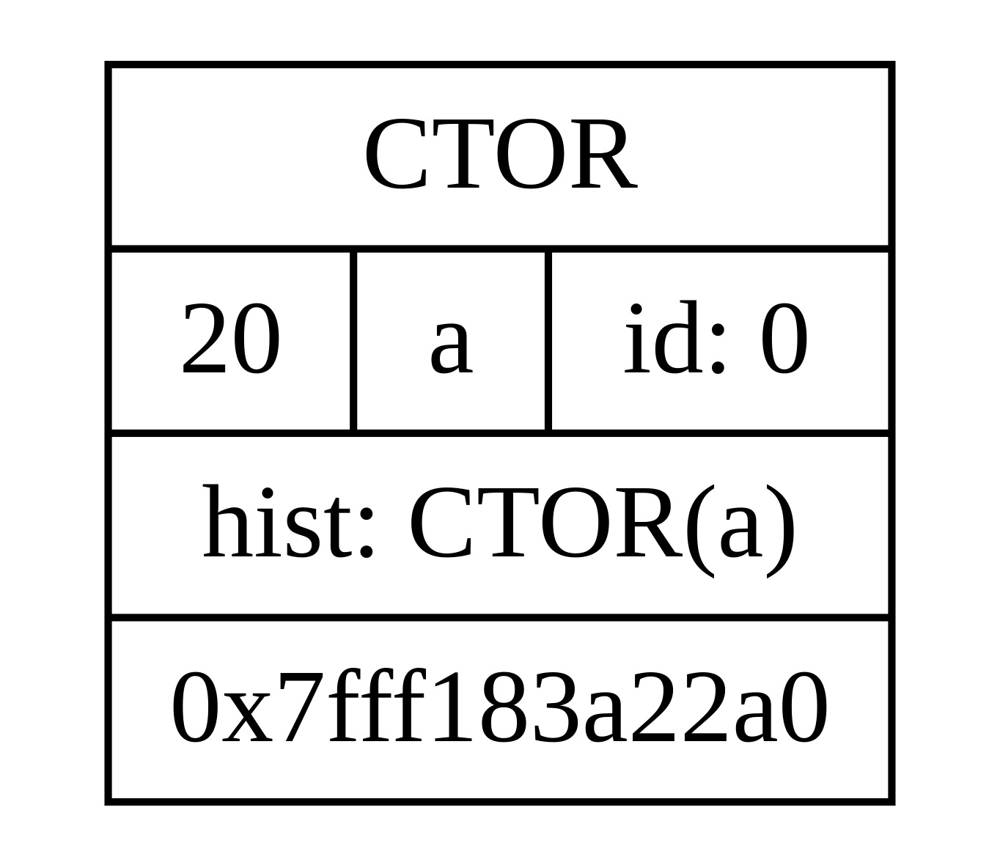
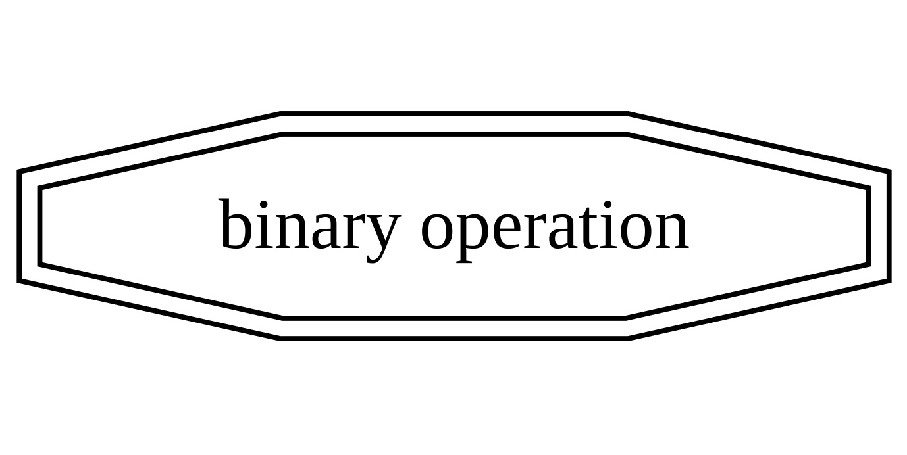
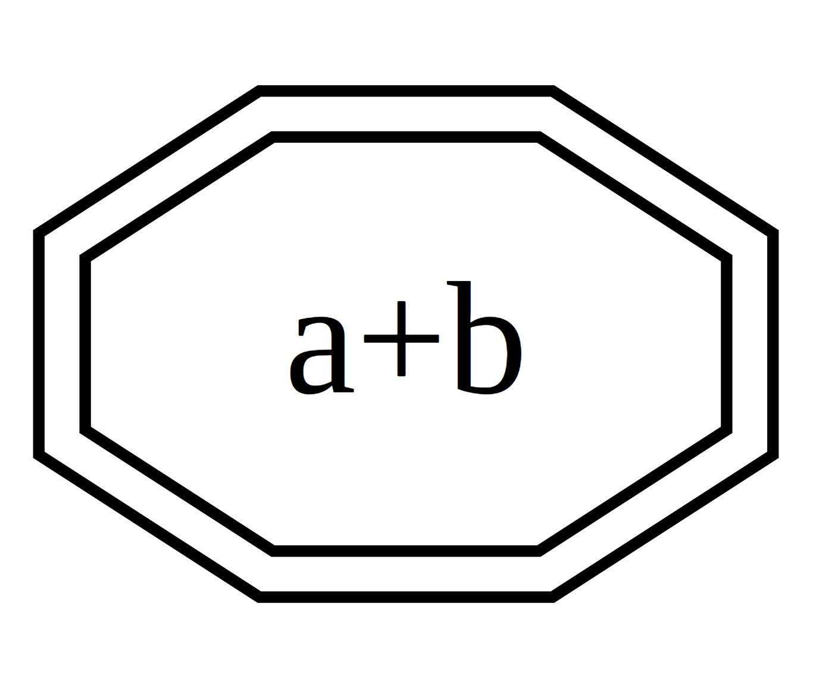
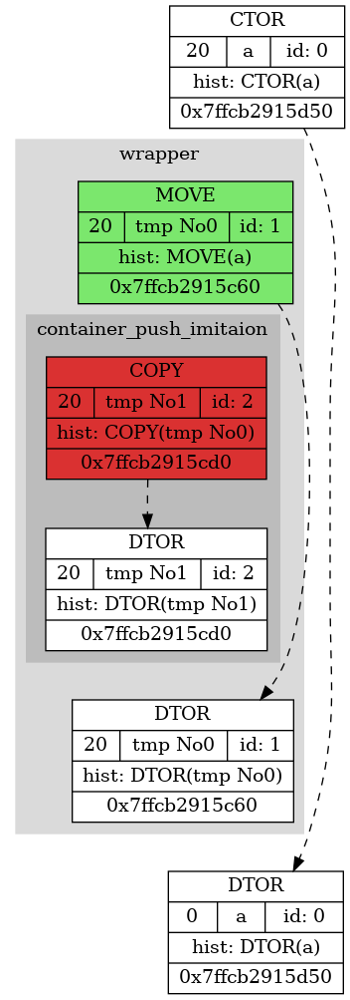
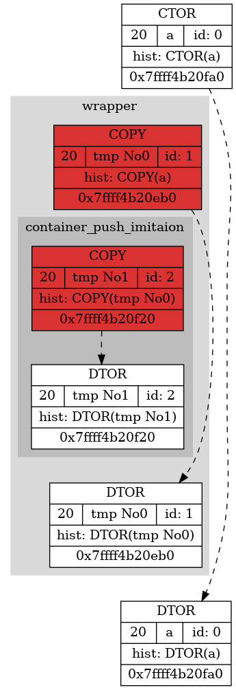
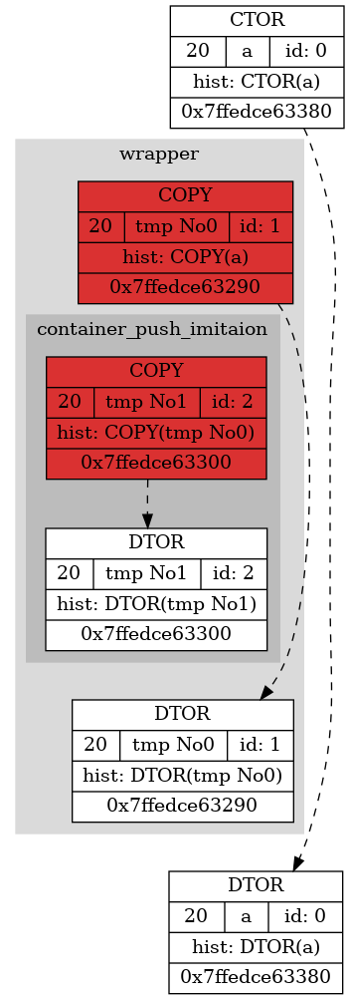
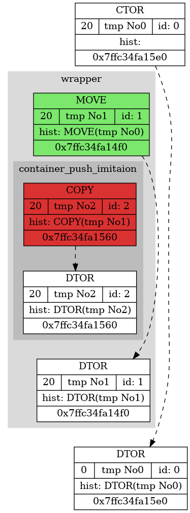

**STD::MOVE vs STD::FORWARDING**
================================
**AUTHORS**
-----------
Research was conducted by a second year student at MIPT Anna Savchuk in 2022. All pictures were also created by author.

**INTRODUCTION**
--------------------
In [last article](https://github.com/s-a-v-a-n-n-a/4th_semester/tree/main/Int_microscope#readme) about move and copy investigation was established that move is better in effectiveness. But is it really appropriate for constant usage and why?

In this investigation `std::move` and `std::forward` will be studied and some illustrating examples will be shown.

**INSTRUMENTS**
---------------
The instruments are actually the same as in the above-mentioned article but the main information will be doubled here for busy people.

This project contains intercepted realisation of 32-bit int type.

OS: Linux.

The  author used visual dump in dot to conduct the investigation.

There are several designations in graphical dump used. 
<li>
  Red structions show copy operators. Green ones are for move operators.
</li>
<li>
  Black dashed arrows are for showing the time that variable exists. They link its constructor and destructor respectively.
</li>
<li>
  Black solid lines show the connections between operations. If two numbers are added, the reader will be able to see connections between struction for operator+ and structions for variables. 
</li>
<li>
  To show the changes of the variable red solid arrows used. As not to clutter up the picture there is no red lines between constructors and destructors if they are only operators that changed the variable.
</li>
<li>
  Grey clusters used for entering the scope of a function. Its name is also written on clusrter's top.
</li>
<li>
  <em><b>Picture 0</b></em> shows the organization of information in rectangle boxes. For reasons of clarity the history shows operations since last change of variable.
</li>

| STRUCTURE | EXAMPLE |
|:---------:|:-------:|
|  |  |
| <em><b>Picture 0</b> The structure of rectangles.</em> | <em><b>Picture 1</b>  Example of rectangle structure.</em> |

<li>
  Hexagons show binary operations.
</li>

| STRUCTURE | EXAMPLE |
|:---------:|:-------:|
|  |  |
| <em><b>Picture 2</b> The structure of hexagons.</em> | <em><b>Picture 3</b> The structure of hexagons.</em> |

To disable copy elision `-fno-elide-constructors` flag is used.

**COMMENT**
-----------

In reasons of author's education `my_move` will be removed by `std::move` and `my_forward` removed by `std::forward`. They actually do the same but I needed to understand how they work because I am a student.

**MOTIVATION**
--------------
Imagine a situation when you want to optimize your program by moving the content from place to place but compiler copies it in reasons that are set in its rules. For example, working with different containers we sometimes want to move the content of variable than to copy it:

<pre><code>template&ltclass T&gt
void imitaion(T&& arg) 
{
    Spy spy(__FUNCTION__);
    
    // like writing into container
    volatile auto local_tmp = arg;
}

template&ltclass T&gt
void wrapper(T&& arg) 
{
    Spy spy(__FUNCTION__);
    
    imitaion(arg);
}

void test()
{
    wrapper(Intercepted_int(22));
}
</code></pre>

Compilator copies the argument because it turns into lvalue in `wrapper`. But sometimes we don't want to have extra copies of one value. How that can be fixed? `std::move` can help:

<pre><code>template&ltclass T&gt
void imitaion_with_move(T&& arg) 
{
    Spy spy(__FUNCTION__);
    
    // like writing into container
    volatile auto local_tmp = my_move(arg);
}

template&ltclass T&gt
void wrapper(T&& arg) 
{
    Spy spy(__FUNCTION__);
    
    imitaion_with_move(arg);
}

void test()
{
    wrapper(Intercepted_int(22));
}
</code></pre>

Now we can observe the results:

| NOTHING WAS USED | MY_MOVE WAS USED |
|:-----------------------------------------------------------------:|:------------------------------------------------------------:|
|  |  |
| ***Picture 4*** Temporary variable turns into lvalue          | ***Picture 5*** The lvalue is forced to be rvalue        |

**FIRST CONCLUSION**
--------------------
It can be seen that `std::move` is used to make everything an rvalue. That is true because it firstly removes any references and then uses static_cast. It is a really useful thing because it calls existing move operators and allows to work with such primitives as containers when there are no default and copy constructors. 

**PROBLEM APPEARED**
--------------------
Let's look at the following example:

<pre><code>template&ltclass T&gt
void container_push_imitaion(T arg) 
{
    Spy spy(__FUNCTION__);
    
    // like writing into container
    volatile auto local_tmp = arg;
}

template&ltclass T&rt
void wrapper(T&& arg) 
{
    Spy spy(__FUNCTION__);
    
    container_push_imitaion(my_move(arg));
}

void test()
{
    VAR(a, 20);
    
    printf("variable a: %d\n",  a.get_num());
    container_push_imitaion(a);
    printf("variable a after \"safe\" function: %d\n", a.get_num());

    wrapper(a);

    printf("variable a after wrapper: %d\n", a.get_num());
}
</code></pre>

Let's make sure that our variable `a` turns into zero (because it can be considered as int's default state):

<code><pre>
variable a: 20
after "safe" function: 20
after wrapper: 0
</code></pre>

It is not desired behaviour of our program.

Now `std::forward` comes to help us:

<pre><code>template&ltclass T&gt
void container_push_imitaion(T arg) 
{
    Spy spy(__FUNCTION__);
    
    // like writing into container
    volatile auto local_tmp = arg;
}

template&ltclass T&rt
void wrapper(T&& arg) 
{
    Spy spy(__FUNCTION__);
    
    container_push_imitaion(my_forward&ltT&gt(arg));
}

void test()
{
    VAR(a, 20);
    
    printf("variable a: %d\n",  a.get_num());
    container_push_imitaion(a);
    printf("variable a after \"safe\" function: %d\n", a.get_num());

    wrapper(a);

    printf("variable a after wrapper: %d\n", a.get_num());
}
</code></pre>

This code will show the other result:

<code><pre>
variable a: 20
after "safe" function: 20
after wrapper: 20
</code></pre>

And it is OK.

Time to see the changes:

| STEALING MOVE | FAIR FORWARD |
|:-------------------------------------------------------------------------:|:----------------------------------------------------------------------------:|
|  |  |
| ***Picture 7*** In destructor `a` turns into 0, but it never changed intentionally         | ***Picture 8*** Everything is ok        |

Here is significant table to differentiate one operation from another:

| PASSED PARAMETER | STD::MOVE | STD::FORWARD |
|:----------------:|:---------:|:------------:|
| T | T&& | T&& |
| T& | T&& | __T&__ |
| T&& | T&& | T&& |

**A TINY CATCH**
----------------
Attentive reader may argue: if we pass this argument without `std::forward` the result will be the same:

| PASSING LVALUE WITH FORWARD | PASSING LVALUE WITHOUT FORWARD |
|:----------------------------------------------------------------------------:|:-------------------------------------------------------------------:|
|  |  |
| ***Picture 8***        | ***Picture 9***       |

The answer is simple: everything is about passed argument. Let us see the example where we pass rvalue as before:

<pre><code>template&ltclass T&gt
void container_push_imitaion(T arg) 
{
    Spy spy(__FUNCTION__);
    
    // like writing into container
    volatile auto local_tmp = arg;
}

template&ltclass T&gt
void wrapper(T&& arg) 
{
    Spy spy(__FUNCTION__);
    
    // or just `container_push_imitaion(arg);` in other case
    container_push_imitaion(my_forward&ltT&gt(arg));
}

void test()
{
    wrapper(Intercepted_int(20));
}
</code></pre>

The result is:

| PASSING RVALUE WITH FORWARD | PASSING RVALUE WITHOUT FORWARD |
|:----------------------------------------------------------------------------:|:-------------------------------------------------------------------:|
|  |  |
| ***Picture 10*** Forward turned into move        | ***Picture 11*** Copy again       |

**SECOND CONCLUSION**
---------------------
Now it is clear that if we want to save values in intentionally created variables and avoid copies of one temporary `std::forward` is good enough. It casts lvalue to lvalue and rvalue of any type to rvalue.

**WHY NOT ONLY STD::FORWARD**
-----------------------------
A very good question if we can use only `std::forward` and never `std::move`. The answer is "no". Now the reason in ideas of their appearing. `std::forward` demands type specifying which overfills the code. In addition, which is also very important, it is supposed to be used for perfect forwarding, when passing argument through several amount of functions that "eat" the type. These two reasons are enough to use `std::forward` only for specific purpose and use `std::move` instead where it is needed.

**CONCLUSION**
--------------
Now we can get the understanding of how to solve the problem of extra copying. The conclusion is written everywhere but for very busy people it will be also doubled here: "`std::move` is used for displacing and `std::forward` is used for universal referencing." It is quite important to differentiate these two purposes and to use developer-provided tools correctly. 

Eventually, I will double the table comparising `std::move` and `std::forward` as it is a very important result:

| PASSED PARAMETER | STD::MOVE | STD::FORWARD |
|:----------------:|:---------:|:------------:|
| T | T&& | T&& |
| T& | T&& | __T&__ |
| T&& | T&& | T&& |

**RVALUE REFERENCES**
---------------------

 - [Author's github page](https://github.com/s-a-v-a-n-n-a)

 - [Author's article about move and copy operators](https://github.com/s-a-v-a-n-n-a/4th_semester/tree/main/Int_microscope#readme) 

 - [Habr article about lvalues and rvalues](https://habr.com/ru/post/568306/)

 - [cppreference: remove_reference](https://en.cppreference.com/w/cpp/types/remove_reference)

 - [cppreference: std::move](https://en.cppreference.com/w/cpp/utility/move)

 - [cppreference: std::forward](https://en.cppreference.com/w/cpp/utility/forward)
